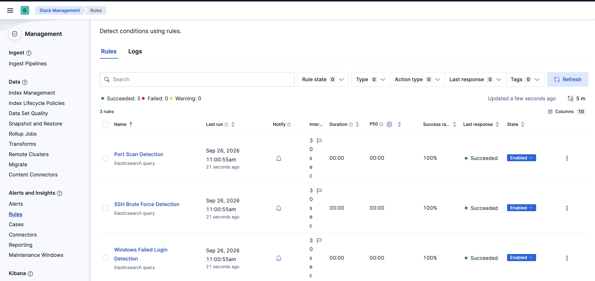
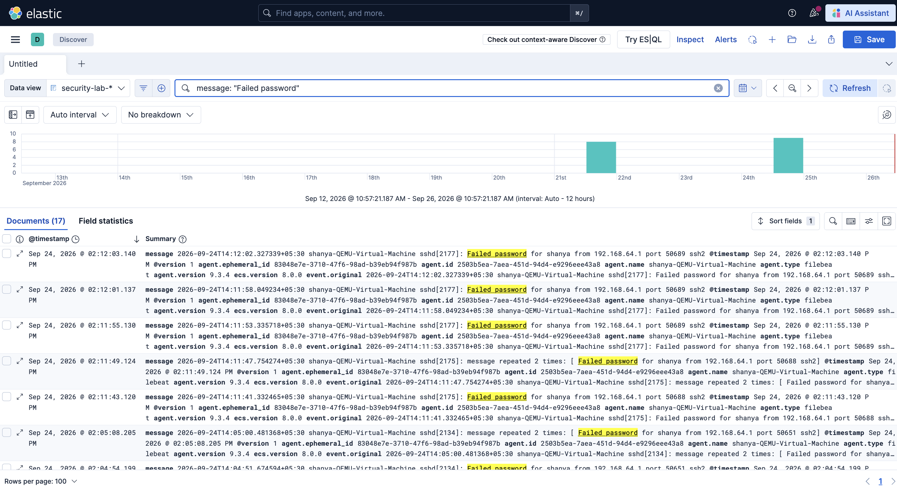
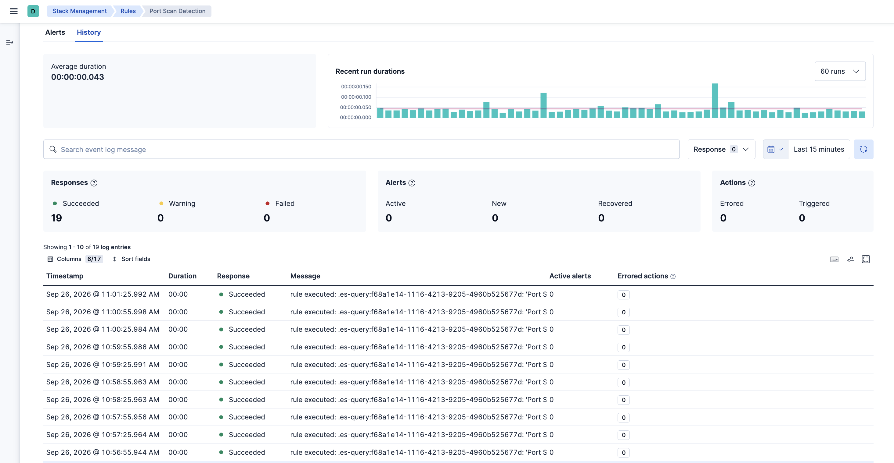
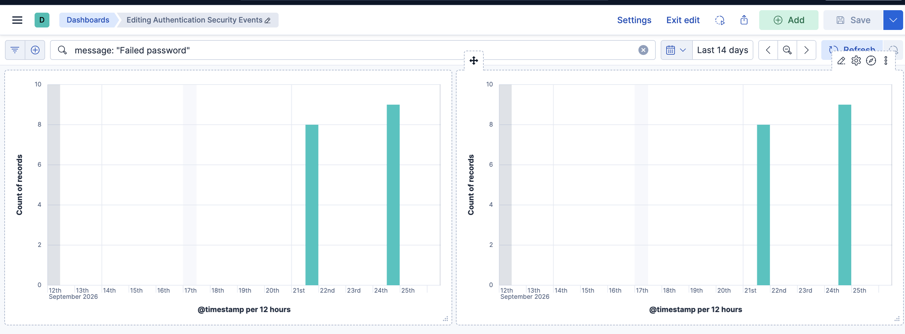
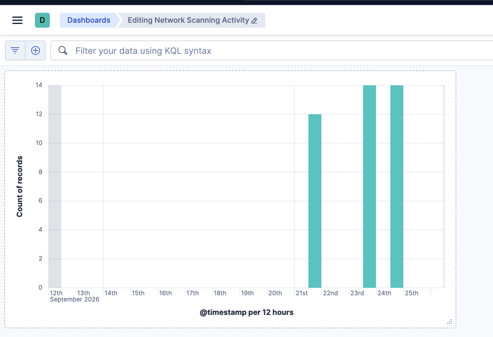
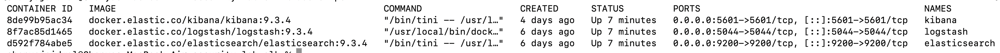

# Local Security Operations Lab: SIEM-Based Threat Detection with ELK

A reproducible SOC/SIEM lab that collects Windows and Linux security telemetry,
simulates real attack patterns, and detects them using custom Elasticsearch
alerting rules — with Kibana dashboards visualizing the results.

Built on cybersecurity fundamentals from a DRDO internship (ELK stack,
Winlogbeat, log forwarding, vulnerability assessment).

## Architecture

- **Windows 11 VM** — Winlogbeat ships Security, System, Application, and
  PowerShell Operational event logs
- **Ubuntu VM** — Filebeat ships `/var/log/auth.log` (SSH) and `/var/log/ufw.log`
  (firewall) to Logstash
- **ELK Stack** (Elasticsearch, Logstash, Kibana 9.3.4) — runs on the host Mac
  via Docker Compose, receiving and indexing all telemetry
- **Kibana Alerting** — custom Elasticsearch query rules evaluate incoming
  logs on a schedule and fire alerts when attack thresholds are crossed


## Attacks Simulated

| Attack | Source | Telemetry |
|---|---|---|
| Nmap port scan | Mac → Ubuntu VM | UFW block logs (`ufw.log`) |
| SSH brute force | Mac → Ubuntu VM | Failed password entries (`auth.log`) |
| Failed Windows logins | Windows VM lock screen | Event ID 4625 |
| Suspicious PowerShell execution | Windows VM | Event ID 4104 (Script Block Logging) |

## Detection Rules

| Rule | Logic | Window |
|---|---|---|
| SSH Brute Force Detection | 5+ `"Failed password"` entries | 1 min |
| Windows Failed Login Detection | 5+ Event ID 4625 | 1 min |
| Port Scan Detection | 10+ `"UFW BLOCK"` entries | 1 min |

Each rule runs every 30 seconds via Kibana's Elasticsearch query alerting,
querying `security-lab-*` indices and firing an alert when its threshold is
crossed within the time window.

## Dashboards

- **Authentication Security Events** — SSH and Windows failed login attempts
  over time
- **Network Scanning Activity** — UFW-blocked connection attempts over time

## Screenshots

**All 3 detection rules configured and running:**


**SSH brute-force attempts captured in Discover:**


**A detection rule firing and recovering:**


**Authentication Security Events dashboard:**


**Network Scanning Activity dashboard:**


**ELK stack running via Docker Compose:**


## Setup

1. **Start the ELK stack**
```bash
   docker compose up -d
```
   Elasticsearch: `http://localhost:9200` · Kibana: `http://localhost:5601`

2. **Configure Winlogbeat** (Windows VM) — copy `winlogbeat-config/winlogbeat.yml`
   to `C:\Program Files\Winlogbeat\winlogbeat.yml`, update `output.logstash.hosts`
   to point at the host machine's IP, then:
```powershell
   .\install-service-winlogbeat.ps1
   Start-Service winlogbeat
```

3. **Configure Filebeat** (Linux VM) — install via `.deb`, copy
   `filebeat-config/filebeat.yml` to `/etc/filebeat/filebeat.yml`, update
   `output.logstash.hosts`, then:
```bash
   sudo systemctl enable filebeat
   sudo systemctl start filebeat
```

4. **Enable PowerShell Script Block Logging** (Windows VM, Administrator):
```powershell
   New-Item -Path "HKLM:\SOFTWARE\Policies\Microsoft\Windows\PowerShell\ScriptBlockLogging" -Force
   Set-ItemProperty -Path "HKLM:\SOFTWARE\Policies\Microsoft\Windows\PowerShell\ScriptBlockLogging" -Name "EnableScriptBlockLogging" -Value 1
```

5. **Recreate detection rules** in Kibana → Stack Management → Rules (see
   `docs/detection-rules.md` for exact query DSL and thresholds).

## Limitations

- Thresholds (5 failed logins/min, 10 UFW block events/min) are tuned for a low-traffic lab environment. A production environment would require baseline-aware thresholds to reduce false positives.
- Detection rules currently rely on keyword and field matching rather than multi-stage correlation. A production SOC could correlate events, such as a port scan followed by a login attempt from the same source IP.
- Source IP grouping is implemented for the relevant detection rules, but the current lab does not perform broader cross-event correlation between different attack types.
- PowerShell Script Block Logging can generate significant log volume in larger environments and would require appropriate retention and filtering.
- Real-time notifications were evaluated but not implemented. Kibana connectors for services such as Slack require a Gold-tier license for the self-managed Elastic Stack configuration used here. A Slack Incoming Webhook was configured and verified up to the connector step, but wiring it into the alert rules was not completed.

## Acknowledgments

Built as an extension of hands-on ELK Stack, Winlogbeat, and vulnerability
assessment work completed during a DRDO cybersecurity internship.
